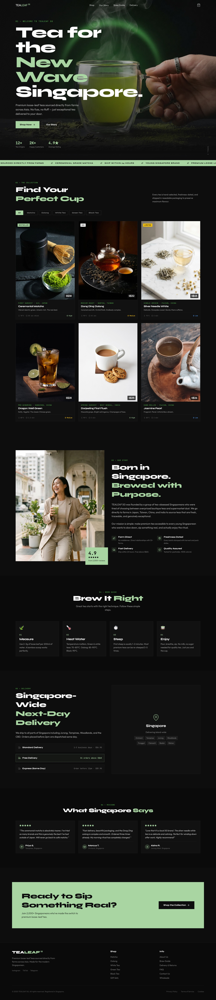
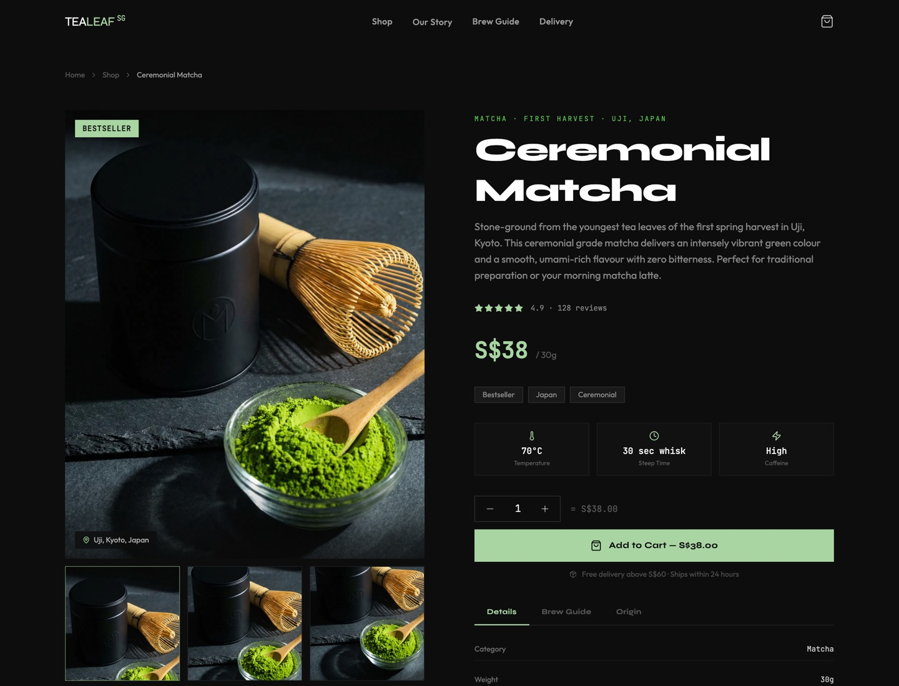
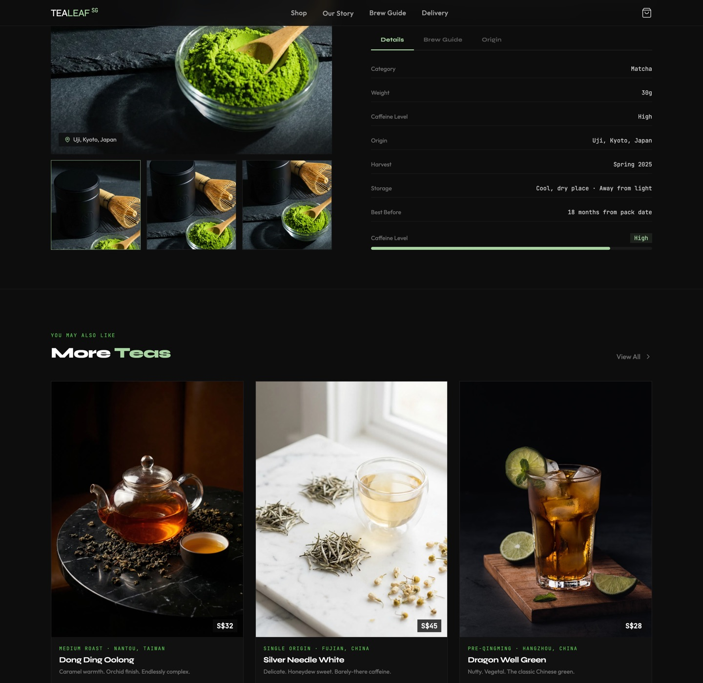
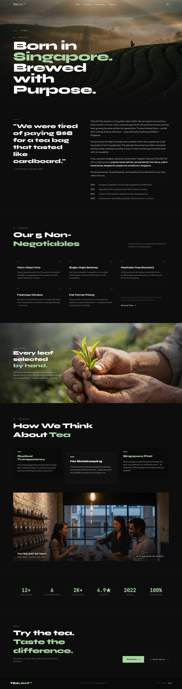

# TEALEAF SG

Premium loose-leaf tea e-commerce for the modern Singaporean. Dark, bold, street-luxe aesthetic.

> *"We were tired of paying S$8 for a tea bag that tasted like cardboard."*

---

## Overview

TEALEAF SG is a tea e-commerce storefront targeting young consumers in Singapore. The design follows an **SG Street Luxe** aesthetic — a dark moody base (`#0D0D0D`) with matcha green accents (`#A8D5A2`), magazine-style asymmetric layouts, and bold geometric typography.

Built with **React 19 + TypeScript**, styled with **Tailwind CSS v4**, animated with **Framer Motion**, and served via **Express**.

## Screenshots

### Home Page
Full-bleed hero, marquee strip, product grid with category filters, brand story, brew guide, delivery info, reviews, and CTA.



### Product Detail
Sticky product image with badge & origin tag, quantity selector, tabbed info (Details / Brew Guide / Origin), and related products carousel.





### About Page
Brand story with timeline, sourcing standards (5 non-negotiables), team philosophy, milestones data strip.



## Features

- **Product Catalog** — 6 premium teas (Matcha, Oolong, White Tea, Green Tea, Black Tea) with detailed brew parameters, origin traceability, and caffeine levels
- **Shopping Cart** — Slide-out drawer with quantity controls, subtotal calculation, free delivery threshold (S$60), and checkout flow
- **Product Detail Pages** — Sticky image layout, tabbed info (Details / Brew Guide / Origin), related products section
- **About Page** — Brand story with timeline, sourcing standards (5 non-negotiables), team philosophy, and milestone stats
- **Responsive Design** — Mobile-first with glassmorphism navbar, full-screen mobile menu, and adaptive grid layouts
- **Animations** — Scroll-triggered fade-ins, hero text stagger, marquee strip, hover card effects (via Framer Motion)
- **Dark Theme** — Full dark mode by default with oklch color system

## Tech Stack

| Layer | Technology |
|-------|-----------|
| Framework | React 19 + TypeScript |
| Styling | Tailwind CSS v4 + tw-animate-css |
| Animation | Framer Motion |
| Routing | Wouter |
| UI Components | Radix UI + shadcn/ui |
| Icons | Lucide React |
| Forms | React Hook Form + Zod |
| Charts | Recharts |
| Toasts | Sonner |
| Server | Express (Node.js) |
| Build | Vite 7 + esbuild |
| Package Manager | pnpm |

## Design System

**Typography**
- Headings: **Syne ExtraBold** — geometric, high-impact
- Body: **Outfit** — clean, modern sans-serif
- Prices & Data: **JetBrains Mono** — monospaced, technical feel

**Colors**
| Role | Value | Usage |
|------|-------|-------|
| Background | `#0D0D0D` | Base dark surface |
| Accent | `#A8D5A2` | Matcha green — CTAs, highlights, prices |
| Text Primary | `#FFFFFF` | Headings |
| Text Secondary | `rgba(255,255,255,0.6)` | Body copy |
| Text Muted | `rgba(255,255,255,0.4)` | Labels, captions |
| Card Surface | `#111111` | Elevated containers |

**Signature Elements**
- Grain texture overlay (SVG noise filter)
- Marquee strip with brand messaging
- Chapter numbers (`01 — SECTION NAME`) as section labels
- Glassmorphism navbar on scroll

## Project Structure

```
tealeaf-sg/
├── client/
│   ├── index.html
│   ├── src/
│   │   ├── App.tsx                 # Root with routing
│   │   ├── main.tsx                # Entry point
│   │   ├── index.css               # Design system & global styles
│   │   ├── const.ts
│   │   ├── components/
│   │   │   ├── Navbar.tsx           # Glassmorphism nav + mobile menu
│   │   │   ├── ProductCard.tsx      # Grid card with hover overlay
│   │   │   ├── CartDrawer.tsx       # Slide-out shopping cart
│   │   │   └── ui/                  # shadcn/ui components
│   │   ├── contexts/
│   │   │   ├── CartContext.tsx       # Cart state management
│   │   │   └── ThemeContext.tsx      # Theme provider
│   │   ├── hooks/
│   │   │   ├── useComposition.ts
│   │   │   ├── useMobile.tsx
│   │   │   └── usePersistFn.ts
│   │   ├── lib/
│   │   │   ├── products.ts          # Product data & types
│   │   │   └── utils.ts
│   │   └── pages/
│   │       ├── Home.tsx             # Hero + Shop + Story + Brew + Delivery + Reviews
│   │       ├── ProductDetail.tsx    # Individual product page
│   │       ├── About.tsx            # Brand story & sourcing
│   │       └── NotFound.tsx
│   └── public/
├── server/
│   └── index.ts                     # Express static server
├── shared/
│   └── const.ts
├── package.json
├── vite.config.ts
├── tsconfig.json
└── ideas.md                         # Design brainstorm & decisions
```

## Pages

### `/` — Home
1. **Hero** — Full-bleed image, animated headline ("Tea for the New Wave Singapore"), stats strip
2. **Marquee** — Scrolling brand messages on matcha green background
3. **Shop** — Category filter tabs + product grid with hover-to-cart
4. **Our Story** — Lifestyle image + brand narrative + feature grid (Farm Direct, Freshness Dated, Fast Delivery, Quality Assured)
5. **Brew Guide** — 4-step illustrated guide (Measure, Heat, Steep, Enjoy)
6. **Delivery** — Singapore-wide delivery info with area tags + pricing tiers
7. **Reviews** — 3 customer testimonials
8. **CTA Banner** — "Ready to Sip Something Real?"
9. **Footer** — Navigation, social links, legal

### `/product/:id` — Product Detail
- Sticky product image with badge and origin tag
- Quantity selector + Add to Cart
- Tabbed info: Details (specs + caffeine bar), Brew Guide (customized per product), Origin (farm traceability)
- Related products carousel

### `/about` — Our Story
- Hero with editorial headline
- Origin story with pull-quote and timeline (2022–2025)
- 5 sourcing non-negotiables grid
- Full-width sourcing photo with overlay
- Team philosophy cards (Radical Transparency, No Gatekeeping, Singapore First)
- Team photo
- Milestones data strip
- CTA back to shop

## Getting Started

### Prerequisites

- Node.js 18+
- pnpm 10+

### Install & Run

```bash
# Install dependencies
pnpm install

# Start dev server (http://localhost:3000)
pnpm dev

# Type check
pnpm check

# Format code
pnpm format

# Build for production
pnpm build

# Start production server
pnpm start
```

## Product Catalog

| Tea | Origin | Price | Category |
|-----|--------|-------|----------|
| Ceremonial Matcha | Uji, Kyoto, Japan | S$38 / 30g | Matcha |
| Dong Ding Oolong | Nantou, Taiwan | S$32 / 50g | Oolong |
| Silver Needle White | Fuding, Fujian, China | S$45 / 25g | White Tea |
| Dragon Well Green | West Lake, Hangzhou, China | S$28 / 50g | Green Tea |
| Darjeeling First Flush | Makaibari Estate, India | S$35 / 50g | Black Tea |
| Jasmine Pearl | Fujian, China | S$26 / 50g | Green Tea |

## License

MIT
